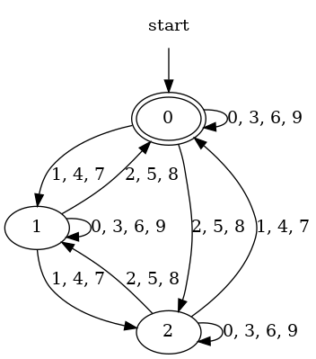

# International Standard Book Numbers

International Standard Book Numbers (ISBNs) are, at one level, quite
simple: in their current form they are strings of 13 digits, with
optional hyphens marking the boundaries between segments of the
number.  The final digit is a check digit which helps make sure that
the rest of the number has been given correctly.

Since the segments for the registration authority (usually a national
or regional body which manages a registry of publishers), the
registrant (usually a publisher), and publication (the book being
identified) are all variable in length, getting the hyphens in the
right positions is tricky and requires knowledge of what numbers have
been asssigned in different registries. Like most tools for checking
ISBNs, this grammar makes no pretense of checking that the hyphens are
in the right places, or even that there are the expected number (none,
or four, if I understand the rules right).

The check digit is used to enable a simple form of validation for
ISBNs.  Each digit in the number is assigned a weight: one for the
first, third, and other odd-nmbered digits, three for the
even-numbered digits.  If each digit in the ISBN is multipled by its
weight (1 or 3, in alternation) and the results are added together,
the sum must be evenly divisible by ten, or else the ISBN is not
valid.

For example, the ISBN 9781441919014 can be validated as follows:
````
    9 * 1
  + 7 * 3
  + 8 * 1
  + 1 * 3
  + 4 * 1
  + 4 * 3
  + 1 * 1
  + 9 * 3
  + 1 * 1
  + 9 * 3
  + 0 * 1
  + 1 * 3
  + 4 + 1
  _______

  = 120
````
Since 120 is evenly divisible by 10, the number is valid.

Alternatively, given the first 12 digits of the ISBN, the check digit
for an ISBN-13 number can be calculated as follows: multiply the first
twelve digits of the number by their weights, sum the resulting
numbers, discard all but the last digit, subtract that last digit from
10, and take the last digit from the result (i.e. if the result is 10,
use zero).  The resulting single-digit number is the correct check
digit.

The obvious way to do this is with a simple program, so it may be
surprising that in fact the set of thirteen-digit numbers with a
correct check digit is a regular language and can be described either
with a (rather large) regular expression or with a finite state
automaton.

The basic principle is perhaps most easily seen with a simpler
example: here is a finite state automaton which recognizes base-10
numerals which are evenly divisible by three:



The FSA recognizes the numeral "12", for example, by starting in state
0, going to state 1 on the first digit by following the arc labeled
"1", then going back to state 0 on the second digit by following the
arc labeled "2".

An FSA to keep track of divisibility by any given modulus (e.g. 10 for
ISBN-13 numbers, 11 for ISBN-10 numbers and ISSNs) will have more
states but is otherwise similar.  If we must multiply the next digit
by a weight, the labels on the arcs will be different and we will need
more states to keep track of which weight to use next, but again the
principles are similar.  For ISBN-13 numbers, which use a modulus of
10 and two alternating weights, an FSA of twenty states would suffice,
except that we also need to count the digits: the first and the fifth
digit of the ISBN may use the same weight, but our grammar needs to
keep them distinct.

Any finite state automaton can be turned into a context-free grammar
in which each rule has a single nonterminal (a state name) on the left
hand side, and one or more right-hand sides each of which is either
empty or has the form *t, N*, where *t* is a terminal symbol and *N*
is the next state.  Rules of the form *N1 = t N2* correspond to a
transition from state *N1* to state *N2* on symbol *t* in the finite
state automaton; an empty right-hand side signals that the state is a
final (or: accept) state.

The grammar in ISBN.ixml can thus be read as a relatively
straightforward description of a finite state automaton to recognize
valid ISBN-13 numbers (with some complications to allow hyphens to
occur).  In addition to any practical utility it may have, it
illustrates the use of ixml to describe finite state automata, and the
use of finite state automata to perform modular arithmetic
calculations.
